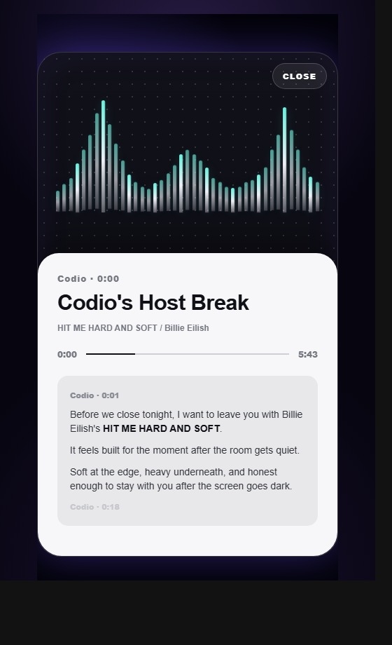

# Codio Local AI Radio

> A local-first private AI radio that reads your day, understands your music library, and lets an AI host plan what you should hear next.

Codio is not just a music player. It is a small personal radio station that runs on your own machine.

It scans your local songs, reads your editable daily routine, builds a radio schedule for morning, work, noon, afternoon, evening, and bedtime, then lets an AI host explain why each song belongs in that moment.

The project was inspired by the idea of a private AI radio host like Claudio, but Codio is built as an open-source, local-first version: your library, your routine, your taste, your terminal.



## Why Codio Exists

Most music apps ask you what you want to play.

Codio asks a different question:

```text
What kind of day are you having, and what should the radio do for that moment?
```

If you are waking up, Codio keeps the signal warm and light.

If you are writing code with Codex, it moves toward focus, fewer vocals, and stable rhythm.

If it is late, it lowers the energy and gives the room a softer ending.

That is the core idea: a private AI radio that treats music as part of your day, not just a queue of files.

## Highlights

- Local-first music library scanning
- Daily routine planning from `user/routines.json`
- AI-generated radio schedule by time of day
- Host intro copy before songs
- Optional MiniMax TTS host voice
- Text chat with Codio
- Song title / artist cleanup tools
- Planner showcase page for demos and videos
- Terminal-style visual radio interface
- Works without API keys through local fallbacks

## Core Experience

Codio combines three layers:

```text
Your Routine       user/routines.json
Your Library       local playable audio files
Codio Brain        planner + host copy + optional TTS
```

Then it produces:

```text
Morning       warm, light, wake-up radio
Work          focused, stable, fewer vocals
Noon          relaxed reset
Afternoon     forward motion
Evening       warm companion energy
Bedtime       quiet, low-energy close
```

## Demo Pages

```text
/                    Main Codio radio terminal
/plan-showcase        Daily radio plan showcase
/recommend-card       End-card recommendation demo
/visual-lab           Visual experiment page
/voice-lab            Voice preview lab
```

The most useful pages for a quick look are:

- `http://localhost:3000`
- `http://localhost:3000/plan-showcase`
- `http://localhost:3000/recommend-card`

## Project Structure

```text
apps/web                 Next.js frontend
apps/api                 Fastify backend
user/routines.json       Editable daily routine
audio/                   Local audio folder, not committed
audio/generated/         Generated TTS cache, not committed
data/                    Local SQLite state, not committed
```

## Quick Start

Install dependencies:

```bash
npm install
```

Copy the environment template:

```bash
cp .env.example .env
```

Start the API server:

```bash
npm run dev:api
```

Start the web app in another terminal:

```bash
npm run dev:web
```

Open:

```text
http://localhost:3000
```

## Configure Your Day

Codio reads your daily routine from:

```text
user/routines.json
```

Example:

```json
{
  "slotId": "deep-work",
  "label": "上午专注",
  "timeRange": "09:00-12:00",
  "activity": "和 Codex 写代码",
  "intent": "把注意力稳定下来，让上午进入持续创作和编码状态。",
  "musicIntent": "希望音乐专注、少人声、稳定，像一条不打扰思路的工作轨道。",
  "displayStyles": ["专注", "少人声", "稳定"],
  "scoringTags": ["steady-groove", "instrumental", "light-electronic", "ambient"],
  "energy": "medium"
}
```

After editing this file, restart the API server or regenerate the planner.

## Add Music

Put playable audio files in your local audio library. Supported formats include:

```text
.mp3 .flac .m4a .wav .ogg
```

NetEase `.ncm` files are not directly playable. Convert or provide playable files first.

Codio tries to parse common filename patterns:

```text
Artist - Song
Song - Artist
```

If a file is parsed incorrectly, you can fix title and artist identity from the library UI.

## Optional AI Features

Codio can run without API keys by using local templates.

For AI chat and host intro copy:

```text
RADIO_LLM_PROVIDER=deepseek
DEEPSEEK_API_KEY=
DEEPSEEK_MODEL=deepseek-chat
```

For host voice generation:

```text
RADIO_TTS_PROVIDER=minimax
MINIMAX_API_KEY=
MINIMAX_TTS_MODEL=speech-2.8-hd
MINIMAX_VOICE_ID=Chinese (Mandarin)_Warm-HeartedAunt
```

Generated voice files are cached in `audio/generated/` and should not be committed.

## Windows Clean Web Restart

If the Next.js dev server reports a missing `.next` chunk such as `Cannot find module './383.js'`, run:

```powershell
cd D:\Projects\local-ai-radio
powershell -ExecutionPolicy Bypass -File D:\Projects\local-ai-radio\scripts\dev-web-clean.ps1
```

## Privacy And Open Source Safety

Codio is designed to keep personal assets local.

Do not commit:

- `.env` or API keys
- local songs
- `audio/generated/`
- `data/*.sqlite`
- logs
- `.next` / build caches

This repository includes `.env.example` as a safe template.

## Scripts

```bash
npm run dev:api
npm run dev:web
npm run build
```

## Status

Codio is an active prototype. The current version is good for local demos, experiments, and showing how a private AI radio can be assembled from a local library, a daily routine, an LLM, and optional TTS.

## License

MIT
